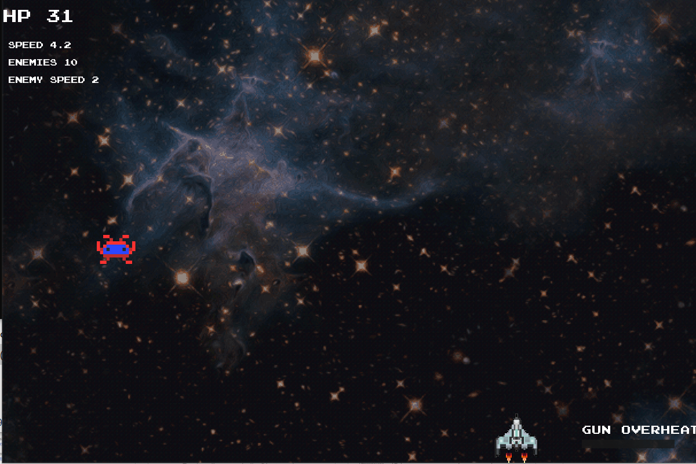

# SpaceShooter game 

SpaceShooter is a simple arcade-like game, which was created as a semester project.
The main goal of the game is to have the most points, which you get by shooting down the enemies - aliens. A player moves using WASD keys and shoot with a LMOUSE.
During a game, you get points after shooting an enemy and lose health when you have contact with an enemy or let an enemy to go past the map.
Additional features are:

Gun overheating mechanic - when you shoot to much, gun reaches a point when it cannot shoot anymore, then you have to wait to cool the gun
Bonuses - health points and temporary speed and shied bonus
When starting a game you can put your nickname and it stores a table of results locally on your computer
Sounds - background music, target hit, enemy collision

